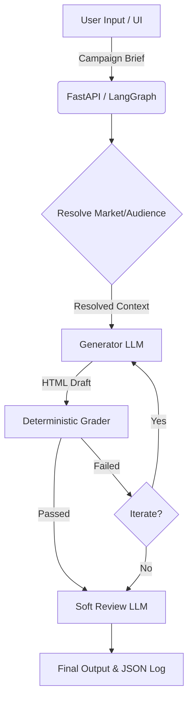

# Pharma Marketing Draft Pipeline (prototype)

## Architecture Workflow


A generate → grade → revise pipeline for pharma email/web marketing
**drafts**. Built around three of the four loop patterns from
[LangChain's "Art of Loop Engineering"](https://www.langchain.com/blog/the-art-of-loop-engineering):

- **Loop 1 (agent/generator loop)** — `generator.py` turns a structured
  brief into a full HTML draft.
- **Loop 2 (verification loop)** — `grader.py` runs 11 deterministic
  structural checks against the draft; `pipeline.py` feeds failures
  back into the generator for up to `MAX_ITERATIONS` revision passes.
  A separate, genuinely agentic layer (`soft_review.py`) handles the
  subjective concerns a deterministic rule structurally cannot — see
  "Deterministic grading vs. the soft-review layer" below.
- **Loop 4 (hill-climbing loop), lightweight version** —
  `trace_logger.py` + `analyze_traces.py` log every attempt so you can
  see which rules the generator trips on most often across many runs,
  and sharpen `prompts/generator_system.md` against real failure data.

Loop 3 (event-driven trigger — webhook/cron kicking off a run) isn't
built yet; `run_pipeline()` in `pipeline.py` is a plain function, so
wiring it behind a FastAPI endpoint or a queue consumer is a small
follow-up, not a redesign.

**Decision made: LangGraph (`pipeline_langgraph.py`) is the live version.**
`app.py` runs on it directly — every request goes through
`build_graph().stream(...)`, and the UI's step-by-step log is built
from the graph's own node updates, not manual print statements. Both
files still exist and both call the exact same underlying functions in
`generator.py`/`grader.py`/`regulatory.py`/`soft_review.py`, so
`pipeline.py` stays as a simpler reference implementation (and a
useful "does the logic itself work, independent of any orchestration
choice" sanity check) — but it isn't what the app or CLI demo runs on
anymore. If you want it removed entirely, say so and I'll delete it;
for now I'm keeping it since it costs nothing to leave in place and
having a plain-Python version to point at is genuinely useful if
someone ever asks "walk me through this without the LangGraph
vocabulary."

## What this is *not*

This does not replace ABPI/FDA MLR review. `PipelineResult.approved_for_production`
is hard-coded `False` on every run — passing all checks means the
draft is *structurally* complete (AE box present, HCP tag present, no
brand-name leak in unbranded copy, etc.), not that a qualified human
reviewer has signed off on the clinical claims, fair balance, or final
wording. Treat every checkmark as "ready for a human to review," never
"ready to send."

## Deterministic grading vs. the soft-review layer

All 11 rules in `grader.py` check objective, checkable facts — a
border exists, a string is present, a name is absent. None of them are
judgment calls, so none of them cost an LLM call; an LLM re-checking
"does this border exist" would be strictly worse (slower, costs
tokens, and can rationalize a near-miss as a pass).

But a real MLR review also asks things no regex can answer: does this
copy *imply* an efficacy claim without stating one outright? Is "fair
balance" actually balanced, or just technically present? That's what
`soft_review.py` is for — ONE LLM call, run only after all blocking
grader rules already pass, returning advisory notes that are never
merged into `GradeReport` and never treated as pass/fail. It's the
genuinely agentic half of loop 2; the 11 structural rules are the
deterministic half. Toggle it off (`run_soft_review=False`) if you
don't want the extra call — the pipeline works completely fine
without it.

## Resolving free-text market/audience: dictionary → cache → LLM

`regulatory.py` resolves market/audience input in three tiers, cheapest
first:

1. **Dictionary** (free, instant) — covers UK/US/EU/Swiss and common
   synonyms via word-boundary matching.
2. **Disk cache** (`resolution_cache.json`, free after the first time)
   — any market/audience string an LLM has already resolved once.
3. **LLM fallback** (one call, then cached forever) — only for input
   the dictionary genuinely doesn't recognize, e.g. "Ireland" or
   "formulary committee."

This only fires when a `client` is passed to `resolve_market()`/
`resolve_audience()` — pass `client=None` (the default in ad-hoc use)
and you get the same honest "unresolved" fallback as before, no LLM
call, no surprise cost. `pipeline.py` and `pipeline_langgraph.py` both
resolve exactly once per run, upstream of generation and grading — the
grader itself never triggers any of this, it just receives the
already-resolved `MarketInfo`/`AudienceInfo` as plain data via
`GradingContext`.

## Market-specific rules, not a hardcoded one-size-fits-all set

Early versions of this only varied *which acronym* (ABPI vs FDA/OPDP)
appeared in the footer per market — everything else was identical
regardless of market, which understates real differences (EU/UK
additional-monitoring black-triangle requirements, US Boxed Warning
placement rules, DTC advertising restrictions that don't exist in the
same form in the US). `regulatory.py::MARKET_MAP` now carries
market-specific notes alongside the regulatory tag, injected into the
generator's user prompt via `market_addendum()`, and `grader.py` has
two dedicated market-specific rules (`black_triangle` for UK/EU,
`boxed_warning` for US) on top of the 9 structural ones. Both are
non-blocking "confirm with regulatory" reminders, not pass/fail
verdicts — the tool has no way to know a specific product's actual
monitoring or Boxed Warning status, so it flags the question rather
than guessing the answer. Extending to more markets is adding an
entry to `MARKET_MAP`, not touching the grader's control flow.

## Token cost strategy

Four things keep this from burning tokens needlessly, in rough order
of impact:

1. **The dictionary/cache-first resolver above** — most real traffic
   (UK/US/EU/Swiss, obvious HCP/patient keywords) never reaches an LLM
   call at all.
2. **Fewer wasted iterations.** Market-specific guidance (black
   triangle, Boxed Warning) is in the *first* generation call's
   prompt, not only surfaced after a failed check — a correct first
   draft costs one call end-to-end; a wrong one costs two full calls
   (generate + revise) for the same result. A stuck-loop detector also
   stops the whole run after 2 identical failures instead of burning a
   3rd call repeating a mistake that's already proven not to fix itself.
3. **Prompt caching on the one big stable block.** `generator.py`'s
   `SYSTEM_PROMPT` is loaded once and reused byte-for-byte forever —
   it's deliberately market-agnostic (market content lives in the
   per-call user prompt instead) specifically so it stays one constant
   ~1000-token prefix. Azure OpenAI documents automatic caching on
   repeated >=1024-token prefixes, no code required — but I haven't
   independently verified this applies identically for a reasoning-
   model deployment like `gpt-5-mini` on API version `2025-01-01`
   specifically, so treat `usage.cache_read_input_tokens` in your
   actual run output as the real answer, not this doc.
4. **Reasoning effort, for reasoning-model deployments specifically.**
   `gpt-5-mini` (and similar) spend hidden "reasoning tokens" before
   writing visible output — these count as real output cost but never
   appear as content. `llm_client.py` sets `reasoning_effort="low"` for
   any deployment it detects as a reasoning model, since writing a
   templated HTML draft doesn't need deep deliberation. Watch
   `usage.reasoning_tokens` in your actual output — if it's a large
   fraction of `output_tokens`, that's tokens spent thinking, not
   writing.
5. **Soft review is opt-out and only runs once, on success.** One
   extra call maximum per run, never spent on a draft that isn't
   structurally complete yet.

`LLMClient.last_usage` exposes real token counts after every call
(`input_tokens`, `output_tokens`, and `cache_read_input_tokens` /
`reasoning_tokens` when Azure returns them) — both `app.py` and
`pipeline.py`'s CLI smoke test print these so you can see the actual
numbers, not just take a description of them on faith.

## No fallback mechanisms

Two deliberate constraints, added after hitting real integration
issues while testing this against an actual Azure key:

1. **One provider, no alternates.** `llm_client.py` supports Azure
   OpenAI only. An earlier version tried an Azure AI Foundry endpoint
   style and then Anthropic as fallbacks if the primary path wasn't
   configured — that's gone. There's exactly one credential this
   project actually uses, so there's exactly one code path. Missing
   credentials raise immediately, with a message telling you exactly
   what env vars are missing.
2. **No exception-swallowing that produces a placeholder result.**
   `regulatory.py`'s LLM-fallback resolvers and `soft_review.py` used
   to catch API failures and return a fake "resolution failed" /
   "review unavailable" result that looked like a normal, valid
   outcome. All of that is gone — a failed API call, malformed JSON
   response, or corrupted/unwritable cache file now raises a real
   exception instead. If something breaks, you'll see a real
   traceback, not a checkmark that quietly means something different
   than it looks like it means.

**What's intentionally NOT covered by this, because it's a different
thing:** an unrecognized market/audience with `client=None` (no LLM
call attempted at all), or a successful LLM response that says "I'm
not confident," still resolves to an honest `known=False` state
without raising. That's not a failure being hidden — it's a real,
valid answer ("I don't know" is a legitimate resolution outcome). Only
an actual broken call now raises; a successful call that's honestly
uncertain still degrades gracefully, on purpose.

**One necessary exception:** `live-loop-demo.html` (the standalone
browser demo) still calls the Anthropic API, because that's a platform
constraint of the artifact environment it runs in, not a choice made
in this codebase — it's not part of the Python pipeline you're
actually running, and doesn't touch your Azure credentials at all.
Everything under `pip install -r requirements.txt` / `python
pipeline_langgraph.py` / `streamlit run app.py` is 100% Azure-only.

## Setup

```bash
pip install -r requirements.txt

export AZURE_OPENAI_API_KEY="..."
export AZURE_OPENAI_ENDPOINT="https://<resource>.openai.azure.com"
export AZURE_OPENAI_API_VERSION="2025-01-01"
export AZURE_OPENAI_DEPLOYMENT="gpt-5-mini"
```

This is Azure-only, on purpose — no fallback to another provider if
these aren't set, and `llm_client.py` will raise immediately rather
than silently trying something else. See "No fallback mechanisms"
below for the full reasoning.

**Note on `gpt-5-mini` specifically:** it's a reasoning model, which needs
different API parameters than a plain chat model (`max_completion_tokens`
instead of `max_tokens`, no custom `temperature`, plus a `reasoning_effort`
setting). `llm_client.py` detects this automatically from the deployment
name and switches parameters accordingly — you don't need to configure
anything extra for this, but if you ever rename the deployment to
something that doesn't obviously contain "gpt-5", check
`_is_reasoning_model()` in `llm_client.py`.

## Run it

```bash
# CLI smoke test, LangGraph version (mirrors your sample input: UK, HCP, Dovato,
# pre-launch awareness) — prints each node as it runs
python pipeline_langgraph.py

# Same logic, plain-Python reference version
python pipeline.py

# Full UI — runs on pipeline_langgraph.py directly, soft review is an
# unchecked-by-default checkbox in the form
streamlit run app.py

# After you've run a few briefs through it:
python analyze_traces.py
```

## File map

| File / Directory | Role |
|---|---|
| `core/schema.py` | `CampaignBrief`, `GradeItem`, `GradeReport`, `PipelineResult`, `SoftReviewNote` — the data contracts |
| `core/config.py` | Centralized application configuration utilizing `pydantic-settings` |
| `core/logger.py` | Structured application logging configuration |
| `core/exceptions.py` | Custom error types like `GenerationError` for control flow |
| `core/regulatory.py` | Free-text market/audience resolution: dictionary → disk cache → LLM fallback |
| `core/llm_client.py` | Azure OpenAI client only — handles reasoning-model params |
| `pipeline/generator.py` | Brief → HTML, plus revision mode |
| `pipeline/grader.py` | 11 deterministic structural rules + `GradingContext`, `BeautifulSoup`-based |
| `pipeline/soft_review.py` | Optional 1-call LLM advisory pass for subjective concerns |
| `pipeline/pipeline_langgraph.py` | Orchestrates resolve → generate → grade → revise → soft-review via `StateGraph` |
| `api.py` | FastAPI backend to run generation requests asynchronously |
| `app.py` | Streamlit UI — orchestrates `ui/` modules and runs on `pipeline_langgraph.py` |
| `ui/` | Modular Streamlit UI components (`sidebar.py`, `dashboard.py`, `history.py`) |
| `docs/architecture.md` | Detailed architectural descriptions for the Generator, Grader, and Regulatory Engine |
| `prompts/generator_system.md` | The Generator's system prompt |

## Validated against your uploaded templates

I ran `grader.py` against `DOVATO-UK-EMAIL-2026-004` as a sanity check
early on (back when the grader had 9 rules, before `black_triangle`
and `boxed_warning` were added): 8 of 9 passed cleanly, including
correctly detecting that the file is unbranded (product name only
appears in the internal annotation footer, never the visible body) and
correctly finding the ABPI reference and HCP-only line. The one
"failure" was the AE line not matching my placeholder wording verbatim
— expected, since that file predates this token system; it's not a
grader bug.

## Known gaps / next steps

- **`rule_ae_box`** matches the AE line against the brand token
  verbatim. That's correct for content this pipeline generated itself,
  but too strict if you ever grade externally-sourced HTML — consider
  a looser "known reporting mechanism per market" check for that case.
- **No image/logo asset pipeline** — logos stay labeled placeholders
  by design (see `prompts/generator_system.md`, rule 7); wiring in
  real approved assets is a deliberate separate step, not something to
  automate away.
- **Loop 3** (event trigger) — straightforward FastAPI wrapper around
  `run_pipeline()` if/when you want brief submission to kick off a run
  asynchronously instead of blocking the Streamlit request.
- **`resolution_cache.json` is a flat, unbounded file** — fine for a
  prototype's traffic volume; a real deployment would want an actual
  TTL/eviction policy so a genuinely wrong LLM resolution (rare, but
  possible) doesn't stay cached forever with no way to invalidate it.
- **Two orchestration files to keep in sync** — `pipeline.py` and
  `pipeline_langgraph.py` share every underlying function but
  duplicate the stuck-detector and revision-loop *control flow*
  logic. If you only end up needing one of them long-term, delete the
  other rather than let them drift apart silently.
